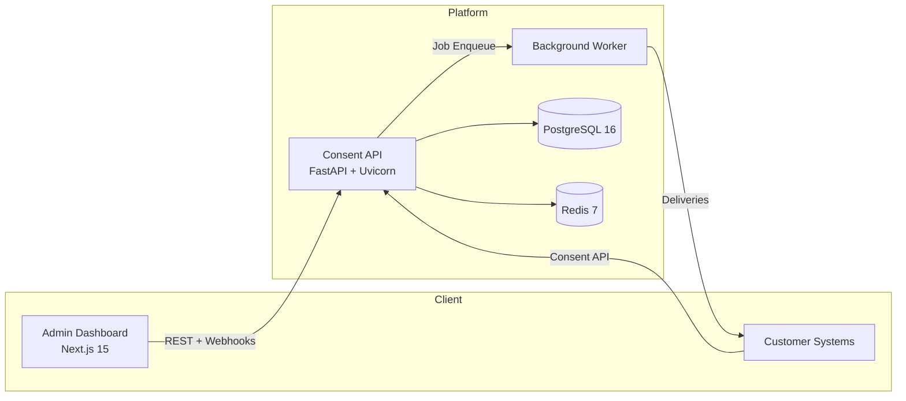

# Architecture

ConsentVault combines a high-performance API with an admin dashboard and background workers. The stack is intentionally small so it can run anywhere Docker is available.

## Components

| Component | Purpose | Notes |
|-----------|---------|-------|
| **Consent API** | Handles consent, rights, audit, and webhook logic. | FastAPI, SQLAlchemy, Alembic migrations, Redis-backed rate limiting. |
| **Admin Dashboard** | Human interface for compliance, CX, and ops teams. | Next.js 15, React Query, Tailwind UI. Talks to the same public API. |
| **PostgreSQL** | System of record for organizations, consents, events, and audit hashes. | Uses Alembic migrations and enum cleanup scripts for deterministic deploys. |
| **Redis** | Provides rate limiting, token blacklists, and worker coordination. | Optional in unit tests; mandatory in staging/production. |
| **Worker** | Sends queued webhooks with retry & signing. | Uses RQ + Redis. |

## Operational Characteristics
- **Stateless API containers** – all state lives in Postgres/Redis so scale-out is linear.
- **Deterministic migrations** – `alembic upgrade head` is safe to rerun; bootstrap scripts reset enums before applying.
- **Cryptographic audit trail** – every consent/right/user event stores a hash chain so auditors can verify tampering.
- **Environment parity** – the same Docker Compose definitions run locally, in staging, and inside production orchestrators.

See [running.md](running.md) for environment-specific details.
